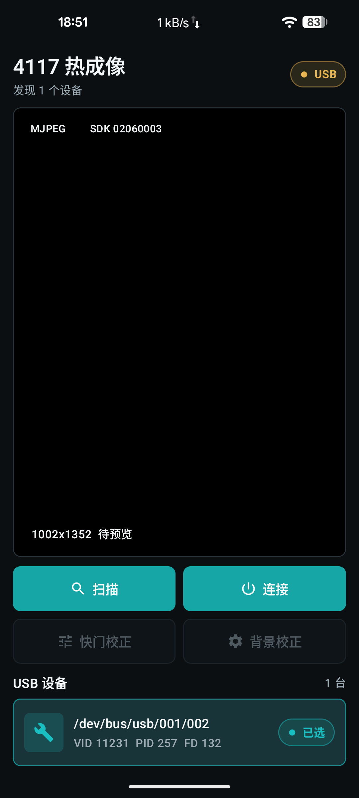
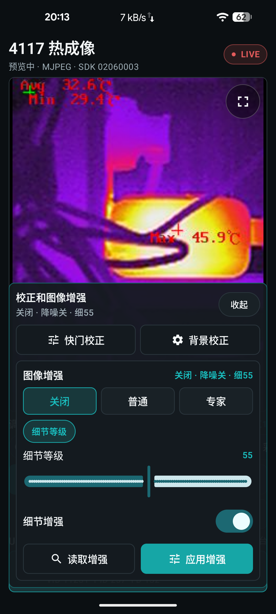
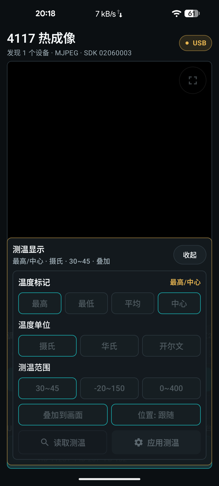
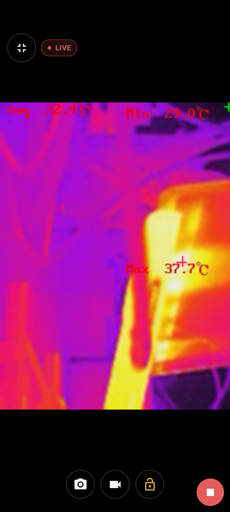

# 4117 热成像 Android

面向维修人员使用的 4117 USB 热成像 Android 应用。项目基于 HCUSBSDK 对接 USB 热成像模块，提供预览、调色板、截图、录像、全屏锁定、图像增强和测温显示配置。

## 功能

- USB 4117 热成像设备扫描、连接、断开
- MJPEG 240x320 预览，等比例显示，不裁剪画面
- 白热、黑热、铁红、彩虹、融合、红热、绿热等调色板
- 截图保存到 `Pictures/ThermalCamera`
- 录像保存到 `Movies/ThermalCamera`
- 全屏预览和锁定，适合维修人员移动巡检
- 图像增强浮动面板：降噪模式、空域/时域降噪、细节增强
- 测温显示浮动面板：最高温、最低温、平均温、中心温、温度单位、测温范围、温度叠加和显示位置
- Release 构建会通过 R8 移除普通 `Log.v/d/i` 调试输出

## 截图

<p>
  
  
  
  
</p>

## 构建

```bash
./gradlew assembleDebug
./gradlew assembleRelease
```

项目默认不提交本地签名文件。没有签名文件时，Debug 使用 Android 默认 debug 签名，Release 产物为未签名 APK。

如果需要在本机使用同一套 Debug/Release 签名，请创建：

```text
app/signing/thermalcamera.properties
app/signing/thermalcamera.jks
```

`thermalcamera.properties` 示例：

```properties
storeFile=signing/thermalcamera.jks
storePassword=your_store_password
keyAlias=thermalcamera
keyPassword=your_key_password
```

`app/signing/` 已被 `.gitignore` 排除，不要提交签名文件。

## SDK

项目使用 HCUSBSDK Android 版本，并通过 SDK 的 Java 接口调用设备能力，包括：

- `USB_StartStreamCallback`
- `USB_GetImageEnhancement` / `USB_SetImageEnhancement`
- `USB_GetThermometryBasicParam` / `USB_SetThermometryBasicParam`
- `USB_SetImageManualCorrect`
- `USB_SetImageBackGroundCorrect`

## 调试

连接设备后可以使用 Android Studio 或 ADB 安装调试：

```bash
adb install -r app/build/outputs/apk/debug/app-debug.apk
adb shell am start -n io.github.xiangtailiang.thermalCamera/.MainActivity
```
